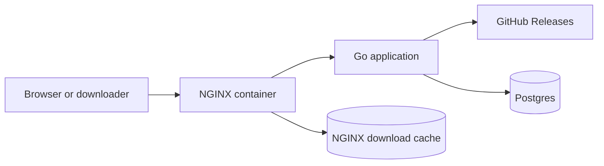

# Download Architecture

Github Downloader separates release selection from file delivery.

The Go application owns repository sync, asset analysis, and download URL
resolution. NGINX owns public request proxying and download response caching.
The application does not call an NGINX API.

## Request Flow

Regular page and API requests pass through NGINX to the Go application.

Download requests use stable `/dl/{owner}/{repo}/{tag}/{asset}` paths. The Go
application resolves the path to a GitHub release asset and streams the asset on
a cache miss. NGINX caches successful download responses by request URI.

For concurrent requests to the same cold download URL, NGINX uses
`proxy_cache_lock` so one request reaches the Go application while the other
requests wait for the cached response. After the cache is populated, later
requests are served by NGINX without another GitHub download.

The `X-Download-Cache` response header exposes the NGINX cache status. Expected
values include `MISS`, `HIT`, and `BYPASS`.

## Deployment Shape

Docker Compose starts three runtime services:

- `nginx`: public HTTP entry point and download cache owner.
- `app`: internal Go application on port `8080`.
- `postgres`: repository and release metadata storage.

`GH_DOWNLOADER_BIND` and `GH_DOWNLOADER_PORT` control the host address and port
exposed by the NGINX service. The Go application is only exposed inside the
Compose network.

Production TLS can still be terminated by a host-level reverse proxy. That
proxy should forward traffic to the Compose NGINX port, not directly to the Go
application.
