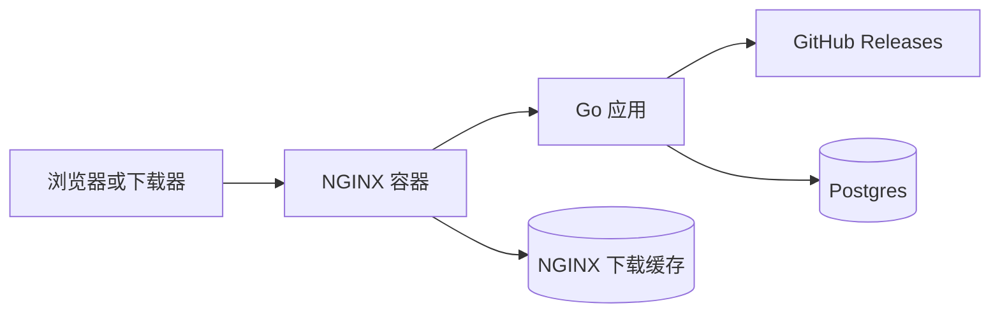

# 下载架构

Github Downloader 将 release 选择与文件分发拆开处理。

Go 应用负责仓库同步、产物分析和下载 URL 解析。NGINX 负责对外代理请求和缓存下载响应。应用不会调用 NGINX API。

## 请求流程

普通页面和 API 请求会经过 NGINX 转发到 Go 应用。

下载请求使用稳定的 `/dl/{owner}/{repo}/{tag}/{asset}` 路径。Go 应用把路径解析为 GitHub release asset；缓存未命中时，应用流式转发该文件。NGINX 按请求 URI 缓存成功的下载响应。

当多个请求同时访问同一个尚未缓存的下载 URL 时，NGINX 通过 `proxy_cache_lock` 只放行一个请求到 Go 应用，其它请求等待缓存响应。缓存写入后，后续请求直接由 NGINX 返回，不再触发新的 GitHub 下载。

`X-Download-Cache` 响应头会暴露 NGINX 缓存状态，常见值包括 `MISS`、`HIT` 和 `BYPASS`。

## 部署形态

Docker Compose 启动三个运行时服务：

- `nginx`：公开 HTTP 入口和下载缓存持有者。
- `app`：内部 Go 应用，监听 `8080` 端口。
- `postgres`：仓库和 release 元数据存储。

`GH_DOWNLOADER_BIND` 和 `GH_DOWNLOADER_PORT` 控制 NGINX 服务暴露到宿主机的地址和端口。Go 应用只暴露在 Compose 网络内部。

生产环境 TLS 仍可由宿主机级反向代理终止。该反向代理应把流量转发到 Compose NGINX 端口，而不是直接转发到 Go 应用。
